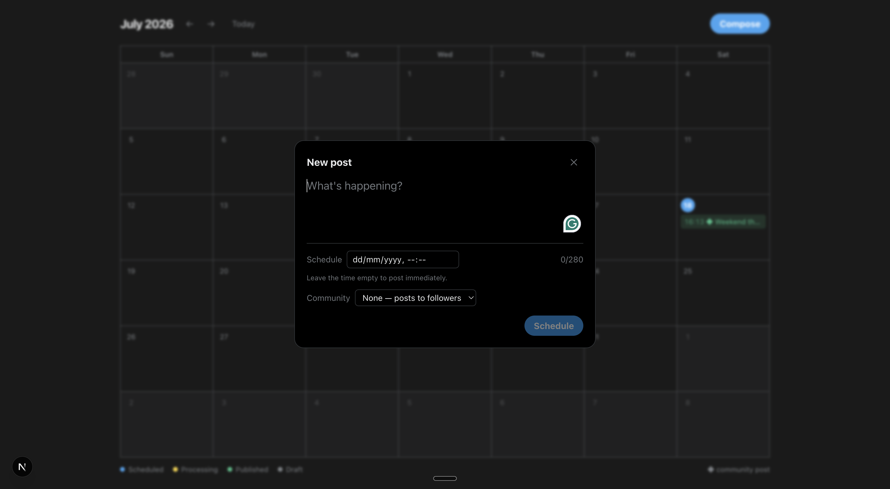
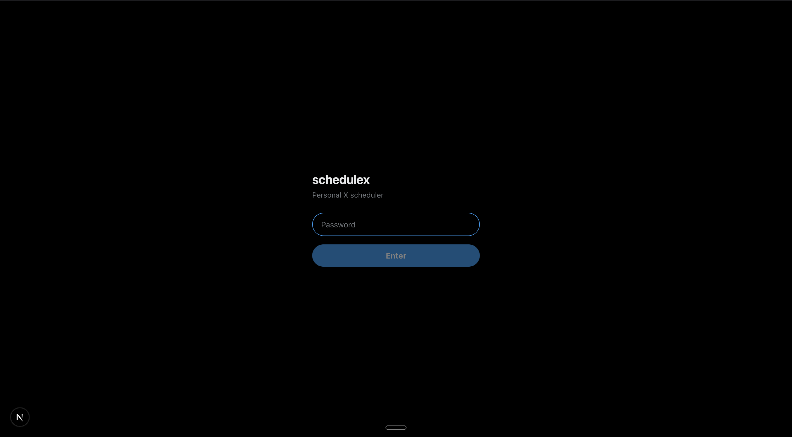

# schedulex

Schedule posts to X and see them on a month calendar. Single user, self-hosted.



## Features

- Month calendar of scheduled and published posts
- Compose, schedule, reschedule, edit, and cancel
- Post to your followers or into an X Community
- Password-protected, single user
- Dark theme

## How it works

Built on the [Post for Me](https://www.postforme.dev) API, which handles X authentication and
fires posts at their scheduled time. Because it stores the posts and the OAuth tokens, this app
needs no database and no background worker — the calendar is a read of the API, rescheduling is
an update, cancelling is a delete.

## Setup

Requires a [Post for Me](https://www.postforme.dev) account with an X account connected.

```bash
git clone https://github.com/<you>/schedulex
cd schedulex
npm install
cp .env.example .env.local
npm run dev
```

Then fill in `.env.local`:

| Variable | Value |
| --- | --- |
| `POST_FOR_ME_API_KEY` | API key from the Post for Me dashboard |
| `X_SOCIAL_ACCOUNT_ID` | Your connected account id from `GET /v1/social-accounts` |
| `APP_PASSWORD` | Password for logging in |
| `SESSION_SECRET` | Generate with `openssl rand -hex 32` |

Open http://localhost:3000 and log in with `APP_PASSWORD`.



## Deploying

Deploys to Vercel with no configuration. Set the four environment variables in the project
settings.

## Limitations

- Text posts only — no images or video
- No threads
- 280 characters
- Community posts are visible only in the community, not to your followers. Posting to both
  means creating two posts.
- Reconnecting your X account in Post for Me changes the account id, so `X_SOCIAL_ACCOUNT_ID`
  must be updated.

## Stack

Next.js 16 · TypeScript · Tailwind CSS · Post for Me

## License

MIT
